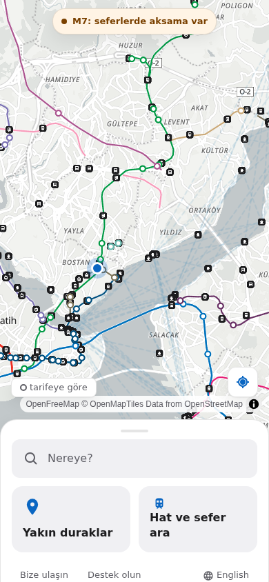
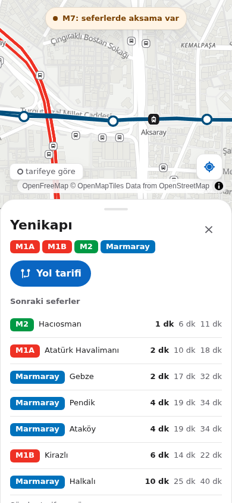
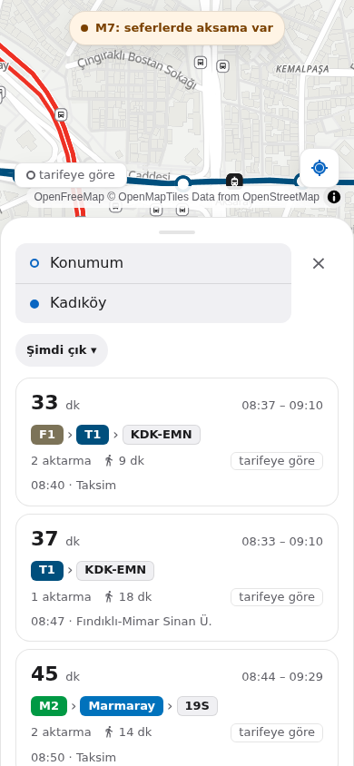
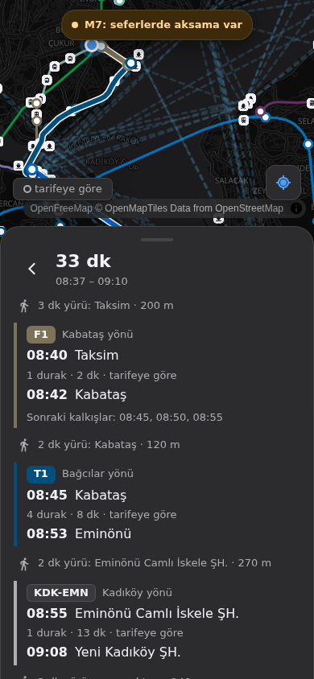
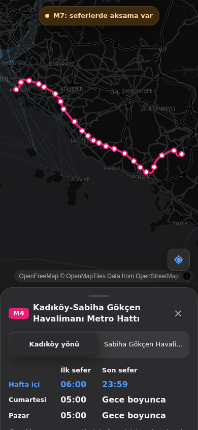
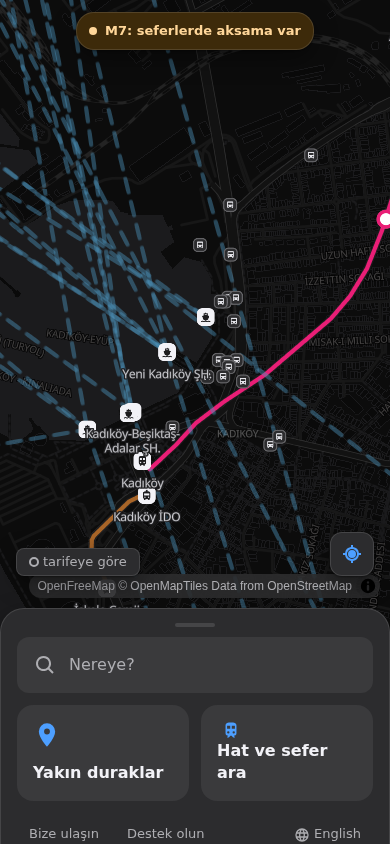

<p align="center">
  <picture>
    <source media="(prefers-color-scheme: dark)" srcset="brand/gitgel-logo-white.png">
    
  </picture>
</p>

# GitGel

İstanbul için ücretsiz, reklamsız, üyeliksiz ve açık kaynak toplu taşıma uygulaması.
Free, ad-free, account-free and open-source public transit app for Istanbul.

<p>
  
  
  
</p>
<p>
  
  
  
</p>

## Türkçe

Uygulamayı aç, "Nereye?" yaz, rotayı gör. Metro, Marmaray, tramvay, füniküler, teleferik, metrobüs, otobüs ve vapuru tek yerde toplar. İETT GPS'inden gelen otobüsler "canlı", tarifeden hesaplanan trenler içi boş halka ve "tarifeye göre" diye gösterilir. Aksama olan hatlarda sade bir uyarı bandı çıkar. Konumun telefonunda kalır, hesap yok, reklam yok, izleme yok.

Ürün vizyonu: [VISION.md](VISION.md). Yol haritası: [TASKS.md](TASKS.md). Veri kaynakları: [docs/research.md](docs/research.md).

## English

Open the app, type "Where to?", see your route. GitGel covers metro, Marmaray, tram, funicular, cable car, Metrobüs, bus and ferry. Buses from İETT GPS are shown as "live"; trains computed from timetables are hollow rings labelled "scheduled". Disrupted lines get a calm notice. Your location stays on your phone; no account, no ads, no tracking.

## How it works

```
Phone (PWA on GitHub Pages)  ── map tiles: OpenFreeMap
      │
      └── API (Oracle Cloud Always Free VM, Docker)
            ├── motis  routing, geocoding, scheduled vehicle positions
            └── live   İETT GPS + Metro İstanbul status, cached
GitHub Actions nightly: ETL → one validated Istanbul GTFS + static JSON (release "data-latest")
               → server re-imports MOTIS, Pages rebuilds the app
```

| Folder | Content |
|---|---|
| `app/` | PWA (Vite, React, TypeScript, MapLibre) |
| `live/` | Live service (Node 24, no runtime dependencies) |
| `etl/` | Python ETL: İETT, Metro İstanbul API, Marmaray/M11/ferries, merge, validation, static JSON |
| `infra/` | Docker Compose, server setup, MOTIS config, deploy script |
| `docs/` | Research, API samples, route tests, performance |

## Run it locally

Requirements: Node 22+, Python 3.11+, Docker, Java 17+ (only for GTFS validation).

```bash
# 1. Data
cd etl
python3 -m venv .venv && .venv/bin/pip install -r requirements.txt
curl -o cache/osm/marmara.osm.pbf --create-dirs https://download.openstreetmap.fr/extracts/europe/turkey/marmara-latest.osm.pbf
.venv/bin/python -m iett.clean --download
.venv/bin/python -m rail.build
.venv/bin/python -m other.build
.venv/bin/python -m merge.build          # add --validate with the MobilityData validator jar in cache/tools/
.venv/bin/python -m static.build

# 2. Routing (MOTIS)
mkdir -p cache/motis && cd cache/motis
osmium extract -b 27.95,40.75,29.95,41.60 ../osm/marmara.osm.pbf -o istanbul.osm.pbf
cp ../../out/istanbul-gtfs.zip ../../../infra/motis/config.yml . && chmod -R a+rwX .
docker run --rm -v $PWD:/work -w /work ghcr.io/motis-project/motis:2.11.3 /motis import -c config.yml -d data
docker run -d -p 8080:8080 -v $PWD/data:/data ghcr.io/motis-project/motis:2.11.3

# 3. Live service
cd ../../../live && npm install && npm start          # :8081

# 4. App
cd ../app && npm install
mkdir -p public/data && cp -r ../etl/out/static/* public/data/
VITE_API_BASE=http://localhost:8080 VITE_LIVE_BASE=http://localhost:8081 npm run dev
```

Tests: `cd etl && .venv/bin/python -m pytest`, `cd app && npm test && npm run lint`, `cd live && npm test && npm run typecheck`, route checks: `python3 scripts/route_tests.py < docs/route-tests.txt`.

## Contributing / Katkı

1. Read [VISION.md](VISION.md) first, especially "Asla olmayacaklar": no accounts, ads, trackers, gamification or undocumented private APIs.
2. Open an issue for a wrong route, a missing stop or a bug. Screenshots and the exact from/to help a lot.
3. Pull requests: keep them small, run the tests above, follow the design rules (8 px grid, one accent colour, transform/opacity-only animation, 44 px touch targets, honest "live"/"scheduled" labels).
4. Timetables without an API (Marmaray, M11, T2, F2) live in `etl/other/manual/*.yaml`; a PR with a corrected timetable and its source link is very welcome.

## Data and attribution

İBB Açık Veri (İBB Open Data License), Metro İstanbul, İETT, © OpenStreetMap contributors (ODbL), OpenFreeMap / OpenMapTiles, MOTIS (MIT).

## License

[AGPL-3.0](LICENSE)
